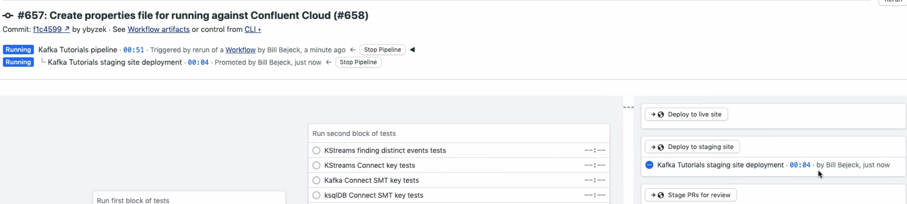
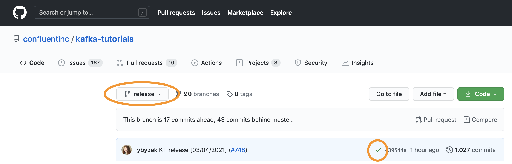

- [Tutorials](#tutorials)
  * [Setup](#setup)
  * [Add code for a new tutorial](#add-code-for-a-new-tutorial)
  * [Using tutorial author tools](#using-tutorial-author-tools)
  * [Description of tutorial parts](#description-of-tutorial-parts)
  * [Add a narrative and test for the tutorial](#add-a-narrative-and-test-for-the-tutorial)
  * [Testing Locally](#testing-locally)
  * [Updating dependency versions](#updating-dependency-versions)
  * [Updating Tutorials](#updating-tutorials)


# Tutorials

This GitHub repo has the source code for Kafka [Tutorials](https://developer.confluent.io/tutorials/). Read about it [in our blog post](https://www.confluent.io/blog/announcing-apache-kafka-tutorials).

## Setup

If you want to hack on this site to add a new tutorial or make a change, follow these instructions.

### Prerequisites

The following prerequisites are **_only_** required if you are going to run the microsite locally.
If you are interested in testing tutorials locally see the [Testing Locally](#testing-locally) section of the README.

- ruby 2.3 or later
- [bundler](https://bundler.io/)
- npm
- python3 / pip3
- gradle
- [Docker Compose](https://docs.docker.com/compose/)

On the Mac, you can get the dependencies like this:

```
brew install ruby node
gem install bundler
```

You'll now have an executable called harness-runner on your path. (Note that if you use Python, you likely already have the `pyyaml` package installed.)

### Installing

#### 1. Clone this repository

```
git clone git@github.com:confluentinc/kafka-tutorials.git
```

Then `cd` into the directory.

#### 2. Install the node packages

```
npm install
```

This will bring in some external JavaScript and CSS packages that we're using.

#### 3. Install the gems

```
bundle install
```

This will install Jekyll itself and any other gems that we use.

#### 4. Run the development server

```
bundle exec jekyll serve --livereload --baseurl /tutorials
```

This will launch a web server so that you can work on the site locally. Check it out on `http://localhost:4000/tutorials/`.

#### 5. Install the Pip package

This repository uses a Python package to facilitate testing the tutorials. To keep things simple, we bundled it into this repository. You can get everything you need by running the following:

```
pip3 install pyyaml
cd harness_runner
pip3 install -e .
```


#### 6. Running the tests locally

You can run any of the automated tests locally using a command like:

```
cd ..
make -C _includes/tutorials/filtering/ksql/code tutorial
```

Substituting in the appropriate tutorial path.

Note: if you are testing unreleased ksqlDB Docker images, you will need to be logged in to AWS ECR.

## Add code for a new tutorial

A tutorial is a short procedure, targeted at developers, for getting a certain thing done using Confluent Platform.

In many cases, you can get that thing done using one of several _stacks_. For example, you might be able to perform data filtering by writing a KSQL query, by writing a Kafka Streams application, or by directly using the Kafka Consumer API. These comprise the three stacks this site supports: `ksql`, `kstreams`, and `kafka`.

These Tutorials are a bit unique in that each tutorial is self-testing. That is, we have built a light-weight harness system that's able to instrument the code that belongs to each tutorial to make sure that it actually works. This is really useful as we expect to have a lot of tutorials.

With in each stack, these tutorials contain a few pieces. These are described below.

## Using tutorial author tools

There are several pieces that you will put together for a tutorial.  Aside from the original content you need to provide (tutorial description, actual tutorial content, code, etc.), all of the steps described below can be automated.  You accomplish tutorial automation via one of two scripts in the `tools` directory

  1. `gen_project.sh` 
  2. `clone_tutorial.sh`

Let's describe each script.

### The `gen_project.sh` script

As the name implies, the `gen_project.sh` script generates the minimal structure for a viable tutorial.  The code and text contained in the tutorial are place holders, and you'll update those with your code and writing to complete the tutorial.

The script expects you to supply a properties file for setting the name and other parts of the tutorial.  Here's an example properties file you can use.
```sh
#!/bin/sh

# space-separated list of types could be one of ksql or kstreams
CARDS="kstreams ksql"

# all lower-case with no spaces
TUTORIAL_SHORT_NAME=my-tutorial-name

# the MAIN_CLASS variable will generate a test named MAIN_CLASSTest
MAIN_CLASS=FilteringCode
AK_VERSION=3.1.0
CP_VERSION=7.3.0
KSQLDB_VERSION=0.28.2
SEMAPHORE_TEST_NAME="Test name for Semaphore run"
PERMALINK="seo-friendly-link-to-my-tutorial"
```

To run this script:

1. Create a branch
2. Make sure you are in the `kafka-tutorials` base directory
3. Execute `./tools/gen_project.sh my_tutorial_props.sh`

You'll see a lot of information scroll across the screen, describing each step of the tutorial generation process. The last part of the information presented is a checklist of what you'll need to do to complete your tutorial, aside from adding your code and tutorial text.

```
Your tutorial, my-tutorial-name, has been generated successfully!
The script adds a copy of this checklist to the my-tutorial-name directory.
```

There are some additional steps you'll need to take to complete the tutorial:

1. Update the following entries in _data/tutorials.yaml file
    a. title
    b. meta-description
    c. canonical (optional: preferred version of a page)
    d. question
    e. introduction

You can find these fields by searching for my-tutorial-name in the _data/tutorials.yaml file.

2. Add the new tutorial to the tutorials/recipes landing page in Contentful.

3. For completeness, update the link text then add the following link(s) to the [index.html](index.html) file in the appropriate section:

```
   <li><a href="seo-friendly-link-to-my-tutorial/kstreams.html">MEANINGFUL LINK TEXT HERE</a></li>
   <li><a href="seo-friendly-link-to-my-tutorial/ksql.html">MEANINGFUL LINK TEXT HERE</a></li> 
```

If you only specified one tutorial type (`ksql` or `kstreams`) then you'd only have one link in the output.  Also, a copy of this output is copied in your tutorial directory `/Tutorials base dir/_includes/tutorials/you_tutorial_short_name`

### The `clone-tutorial.sh` script

As the name implies, this script creates a clone of an existing tutorial.  The clone script changes the name of the tutorial throughout the content.  To clone a tutorial, you also need to provide a properties file

```sh
#!/bin/sh

#SAMPLE-PROPERTIES-FILE-CONTENT

# By using the basename of a tutorial everything is cloned possibly ksql, kstreams, and kafka 
ORIG_TUTORIAL=connect-add-key-to-source

# to only clone a kafka tutorial
ORIG_TUTORIAL=console-consumer-producer-basic/kafka

# to clone just the ksql part
ORIG_TUTORIAL=connect-add-key-to-source/ksql

# to clone just the kstreams portion
ORIG_TUTORIAL=connect-add-key-to-source/kstreams

!!!! IMPORTANT YOU MUST ONLY HAVE ONE ORIG_TUTORIAL VARIABLE !!!!

# Add a new tutorial name
NEW_TUTORIAL=junkA
# Add a new sempahore test name
SEMAPHORE_TEST_NAME="My New Junk Tutorial"
# Add a new PERMALINK
PERMALINK=a-junk-tutorial
```

To clone a tutorial:

1. Create a branch
2. Make sure you are in the `kafka-tutorials` base directory
3. Execute `./tools/clone_tutorial.sh my-clone-tutorial-props.sh`

You'll see a similar output scroll across the screen, including the checklist for items you'll need to do for a completed tutorial.

### Which script to use?

How do you decide which script to run?  If you are creating a new tutorial that does not resemble an existing tutorial, then the `gen_project` script is probably the better way to go.  If you are creating a tutorial that is closely related to a current tutorial, a hopping-windows tutorial, when there is already a tumbling-windows tutorial, for example, then the clone approach is probably better.

It's still valuable to read through the next section to learn how all the tutorial pieces fit together.


## Description of tutorial parts

_If you used the clone script then many of these will already exist and will just need customising for your particular tutorial._

#### 1. Describe the question your tutorial answers

The first thing to do is articulate what question your tutorial is meant to answer. Every tutorial contains a question and an example scenario. Edit `_data/tutorials.yml` and add your entry. The top item in this file represents the _short name_ for your tutorial. For example, the tutorial for transforming events of a stream is _transforming_. You'll also notice a `status` attribute. You can `enable` as many stacks as you'd like to author for this tutorial, but we recommend starting with just one.

#### 2. Make the directory structure

Next, make a few directories to set up for the project:

```
mkdir _includes/tutorials/<your tutorial short name>/<stack>/code
mkdir _includes/tutorials/<your tutorial short name>/<stack>/markup
```

#### 3. Write the code for the tutorial

Add your code for the tutorial under the `code/` directory you created. This should be entirely self-contained and executable with a `docker-compose.yml` file and a platform-appropriate build. Follow the conventions of existing tutorials as closely as possible.

At this point, you should feel free to submit a PR! A member of Confluent will take care of writing the markup and test files to integrate your code into the site. You can, of course, proceed to the next section and do it yourself, if you'd like.


## Add a narrative and test for the tutorial

This section is generally for those who work at Confluent and will be integrating new tutorials into the site. We need to do a little more work than just authoring the code. We also need to write the markup to describe the tutorial in narrative form, and also write the tests that we described to make sure it all works. This section describes how to do that.

#### 1. Create a harness for the tutorial

The harness is the main data structure that allows us to both test and render a tutorial from one form. Make a new directory under `_data/harnesses/` for your tutorial slug name and stack, like `_data/harnesses/<your tutorial short name>/ksql.yml`. Follow the existing harnesses to get a feel for what this looks like. The main thing to notice is that each step has a `render` attribute that points to a file. Create the markup for this in the next section.

#### 2. Create markup for the tutorial

Under the `markup/` directory that was created earlier, create 3 subdirectories: `dev`, `test`, and `prod`. Write the tutorial prose content here, following the conventions of existing tutorials. These files should be authored in Asciidoc.

#### 3. Tie it all together

Make a file named `/tutorials/<your tutorial short name>/<stack>.html`, specifying all the variables of interest. Note: the directory structure for these files is distinct from `/_includes/tutorials`.

For example, to display the tutorial with the ksqlDB stack:

```yml
# /tutorials/filter-a-stream-of-events/ksql.html
---
layout: tutorial
permalink: /tutorials/filter-a-stream-of-events/ksql
stack: ksql
static_data: filtering
---
```

You can do the same for Kafka Streams and Kafka, by using the `kstreams` and `kafka` stacks, respectively.

#### 4. Add your tutorial into build system

Lastly, create a Makefile in the `code` directory to invoke the harness runner and check any outputs that it produces. Then modify the `.semaphore/semaphore.yml` file to invoke that Makefile. This will make sure your tutorial gets checked by the CI system.

## Testing Locally

Each tutorial shows how to manually execute each tutorial step-by-step.
However, there are some scenarios when a user may want to run and test a tutorial in a more automated fashion:

- End-to-end: user makes a small change to the code and wants to validate that the tutorial still works end-to-end
- Run-and-play: user runs a tutorial and wants to leave it running to play with the environment

This section describes how you can do either of these scenarios using the `harness-runner` to programmatically run a single tutorial.

### Prerequisites

The following prerequisites are required if you are going to run a tutorial programmatically.

- python3 / pip3
- gradle
- [Docker Compose](https://docs.docker.com/compose/)

### Environment Setup

1. Check out the kafka-tutorials GitHub repo:

```bash
git clone https://github.com/confluentinc/kafka-tutorials.git
cd kafka-tutorials
```

2. Install the packages for the harness runner.

If you have `pip3` installed locally:

```bash
(cd /harness_runner/ && pip3 install -e .)
```

If you don't have `pip3` installed locally, create a `Dockerfile` with the following content:

```text
FROM python:3.7-slim
RUN pip3 install pyyaml
```

and then run the following command to build and execute the Docker image:

```
docker build -t runner . ; docker run -v ${PWD}/harness_runner:/harness_runner/ -it --rm runner bash -c 'cd /harness_runner/ && pip3 install -e .'
```

3. Install [gradle](https://gradle.org/install/) for tutorials that compile any code.

4. Install Docker Compose

### Run a tutorial

1. (optional) If you want to augment or override a tutorial's Docker environment, set the Docker Compose CLI environment variable `COMPOSE_FILE` to include `docker-compose.yml` and **_the absolute path_** to a `docker-compose.override.yml` file.  For example, to use Confluent Control Center with any tutorial, set `COMPOSE_FILE` to `docker-compose.yml` and the absolute path to [this docker-compose.override.yml](tools/docker-compose.override.yml).

```
export COMPOSE_FILE=docker-compose.yml:<path to tutorials>/tools/docker-compose.override.yml
```

2. End-to-end: execute the harness runner for a single tutorial by calling `make`, across all `dev`, `test`, and `prod` stages, to validate it works end-to-end. Identify the tutorial you want and then run `make`. Note that this destroys all the resources and Docker containers it created, so it cleans up after itself.  Format: `(cd _includes/tutorials/<tutorial name>/<type>/code && make)` where type is one of `ksql | kstreams | kafka`. Example:

```
(cd _includes/tutorials/transforming/kstreams/code/ && make)
```

3. Run-and-play: execute the harness runner for a single tutorial by calling `make SEQUENCE='"dev, test"'`, just across `dev` and `test` stages, which leaves all resources and Docker containers running so you can then play with it.  Format: `(cd _includes/tutorials/<tutorial name>/<type>/code && make SEQUENCE='"dev, test"')` where type is one of `ksql | kstreams | kafka`. Example:

```
(cd _includes/tutorials/transforming/kstreams/code/ && make SEQUENCE='"dev, test"')
```

Now you can play with the environment, some sample commands shown below.

```
docker exec -t broker kafka-topics --list --bootstrap-server localhost:9092
docker exec -it ksqldb-cli ksql http://ksqldb-server:8088               
```

Because the Docker containers are left running, don't forget to clean up when you are done.

```
docker container ls
docker container rm -f <container id>
```

### Makefile Details

The `Makefile` will delete and re-create the `outputs` directory used to contain files with output from various steps used to verify the tutorial steps.

Here is [the contents of an actual `Makefile`](_includes/tutorials/fk-joins/kstreams/code/Makefile) :

```yml
STEPS_DIR := tutorial-steps
DEV_OUTPUTS_DIR := $(STEPS_DIR)/dev/outputs
TEMP_DIR := $(shell mktemp -d)

tutorial:
  rm -r $(DEV_OUTPUTS_DIR) || true
  mkdir $(DEV_OUTPUTS_DIR)
  harness-runner ../../../../../_data/harnesses/fk-joins/kstreams.yml $(TEMP_DIR)
  diff --strip-trailing-cr $(STEPS_DIR)/dev/expected-output-events.json $(DEV_OUTPUTS_DIR)/music-interest.json
```

The last line uses the `diff` command to validate expected output against the tutorial steps' actual output.  The `Makefile` may have more than one validation action to have separate `diff` commands for each verification.  

For example, here's the `Makefile` from the [dynamic output topics tutorial](_includes/tutorials/dynamic-output-topic/kstreams/code/Makefile)

```yml
STEPS_DIR := tutorial-steps
DEV_OUTPUTS_DIR := $(STEPS_DIR)/dev/outputs
TEMP_DIR := $(shell mktemp -d)

tutorial:
  rm -r $(DEV_OUTPUTS_DIR) || true
  mkdir $(DEV_OUTPUTS_DIR)
  harness-runner ../../../../../_data/harnesses/dynamic-output-topic/kstreams.yml $(TEMP_DIR)
  diff --strip-trailing-cr $(STEPS_DIR)/dev/expected-output.json $(DEV_OUTPUTS_DIR)/actual-output.json
  diff --strip-trailing-cr $(STEPS_DIR)/dev/expected-special-output.json $(DEV_OUTPUTS_DIR)/actual-special-order-output.json
```

### Harness Details

Given that the test harness is the `heart` of a tutorial, it will be helpful to describe in detail how to work with a `kafka|ksql|kstreams.yml` file.  You should note the harness file is in the [YAML file format](https://en.wikipedia.org/wiki/YAML), so formatting properly is essential.  The harness files generate the rendered tutorial structure and validate any output of tutorial steps against expected values.

New tutorial authors should not need to create a harness file from scratch, using either the `tools/gen_project.sh` or  `tools/clone.sh` script will provide a usable harness file.  This section should provide enough guidance to add, update, or remove parts as needed.

#### 1. Structure

Three top-level sections make up the harness file:

* dev - the setup and teaching portion of the tutorial (required)
* test - test setup and execution of tests, if any (optional)
* prod - steps to build and deploy a docker image of the tutorial code (optional)

In some cases, having a test and/or prod section doesn't make sense, so you can omit those portions of the harness file.  The Apache Kafka [console producer and consumer basic operations](_data/harnesses/console-consumer-producer-basic/kafka.yml) and the Apache Kafka [console consumer with primitive keys and values](_data/harnesses/console-consumer-primitive-keys-values/kafka.yml) tutorials are an excellent example of tutorials that don't need a test or prod section.

The `dev`, `test`, and `prod` sections contain a top-level element `steps`.  The `steps` contains any number of well, steps for the user to walk through.  Additionally, the `harness_runner` script follows the same steps for executing the tutorial automatically during builds.  All sections contain the same step structure, so we'll only discuss the make-up of a single section.

For reference here is an example section of the harness file from the [console consumer primitive keys and values tutorial](_data/harnesses/console-consumer-primitive-keys-values/kafka.yml)

```yml
 - title: Get Confluent Platform
      content:
        - action: make_file
          file: docker-compose.yml
          render:
            file: tutorials/console-consumer-primitive-keys-values/kafka/markup/dev/make-docker-compose.adoc

        - action: execute_async
          file: tutorial-steps/dev/docker-compose-up.sh
          render:
            file: tutorials/console-consumer-primitive-keys-values/kafka/markup/dev/start-compose.adoc

        - action: execute
          file: tutorial-steps/dev/wait-for-containers.sh
          render:
            skip: true

        - name: wait for ksqldb-server and connectors
          action: sleep
          ms: 30000
          render:
            skip: true
```


* Title - each section starts with a `title` element, and as the label suggests, the text provided here is the text used the label the step for the tutorial user and the output to the console by the harness runner.  The `title` section contains one element - `content`

* content - the `content` section (a YAML `dictionary`) contains an arbitrary sized list of YAML dictionaries named `action`. An `action` key creates an anonymous step, i.e., not specified in the test runner's output.  For output in the test runner, you can provide a `-name` key, followed by some text for console output.
* action - `action` keys drive the behavior of the harness. An action key can be one of these values
    * `action: make_file` - Prompts the user to create a file for the tutorial.
    * `action: execute` - a synchronous action step
    * `action: execute_async` - an asynchronous step, this indicates a step the user will keep running for some portion of the tutorial.
    * `action: sleep` - pause the test runner for an amount of time specified by the `ms` key. You use `sleep` key to allow some async action to complete
        * `ms: NNN` - the time in milliseconds you want the test harness to pause execution.  You only use `ms` after an `action: sleep` entry.
    * `docker_ksql_cli_session` - an action starting a ksqlDB CLI session for working through a tutorial

In the next sections, you'll see how to use `action` keys to organize your harness files.


#### 2. Action type descriptions and examples

* `make_file`
    The `make_file` instructs the user to create a file an existing file required to run the tutorial.  Some examples are the `docker-compose.yml` file, a `statements.sql` (ksqlDB), and Java files.

    A `make_file` with a file to render look like this:
    ```yml
    - action: make_file
          file: docker-compose.yml
          render:
            file: tutorials/console-consumer-primitive-keys-values/kafka/markup/dev/make-docker-compose.adoc
    ```

    * `file:` the path and name to the file.  The path is relative to `<tutorial-name>/<type>/code>` .The harness runner will use the file during the automated tutorial execution.
    * `render:` the file to render.  The `render` key has one of the two possible keys:
        * `file:` the path and name of the file to render to the user. 

* `execute` The `execute` step is a synchronous execution step during the tutorial for the user and the harness runner

    ```yml
     - action: execute
          file: tutorial-steps/dev/init.sh
          render:
            file: tutorials/console-consumer-primitive-keys-values/kafka/markup/dev/init.adoc
    ```

    Sometimes the `execute` step is an _internal_ step only for the harness runner. Internal steps ignore the `render:` using a `skip: true` entry
    ```yml
      - name: wait for ksqldb-server and connectors
          action: sleep
          ms: 30000
          render:
            skip: true
    ```

    The `execute` steps may also capture output from stdout for tests executed by the harness runner
    ```yml
    - title: Invoke the tests
      content:
        - action: execute
          file: tutorial-steps/test/run-tests.sh
          stdout: tutorial-steps/test/outputs/test-results.log
          render:
            file: tutorials/aggregating-sum/ksql/markup/test/run-tests.adoc
    ```
    Here you can see the `stdout:`  key specifying the file used to capture the output of an `execute` step.

* `execute_async` The `execute_async` step is for steps needing to execute in the background while the user continues going through the tutorial
  
     Here's an example of running `docker compose` to start docker containers to run the duration of the tutorial
     
     ```yml
      - action: execute_async
            file: tutorial-steps/dev/docker-compose-up.sh
            render:
              file: tutorials/console-consumer-primitive-keys-values/kafka/markup/dev/start-compose.adoc
     ```

    Here's another example of using a console consumer. Note the use of `stdout:` to capture the output from the consumer for testing.
    ```yml
     - title: Start an initial console consumer
        content:
          - action: execute_async
            file: tutorial-steps/dev/harness-console-consumer-keys.sh
            stdout: tutorial-steps/dev/outputs/actual-output-step-one.txt
            render:
              file: tutorials/console-consumer-primitive-keys-values/kafka/markup/dev/consume-topic-no-deserializers.adoc
    ```

* `docker_ksql_cli_session` The `docker_ksql_cli_session` sets up ksqlDB tutorial users to start a ksqlDB CLI session so the user can execute various `SQL` files to complete the tutorial.
    ```yml
      - action: docker_ksql_cli_session
          container: ksqldb-cli
          docker_bootup_file: tutorial-steps/dev/start-cli.sh
          column_width: 20
          render:
            file: tutorials/aggregating-sum/ksql/markup/dev/start-cli.adoc
    ```
    The `docker_ksql_cli_session` contains the following keys:
    * `container:` - The name of the [ksqldb-cli docker image in the docker-compose.yml](_includes/tutorials/aggregating-sum/ksql/code/docker-compose.yml#L70-L82) file.
    * `docker_bootup_file:` - Tutorial users and the harness runner [execute this file](_includes/tutorials/aggregating-sum/ksql/code/tutorial-steps/dev/start-cli.sh) to start the dockerized CLI session.
    * `column_width:` - Formats the ksqlDB query output
    * `render:` - The harness renders the file  corresponding to the `file:` key to tutorial users with the command to start the CLI session. 
    * `stdin:` - stdin key [contains one or more `file`](_data/harnesses/aggregating-sum/ksql.yml#L41-L68) keys specifying the different `SQL` file to execute for the tutorial.
    ```yml
        stdin:
            - file: tutorial-steps/dev/create-movie-ticket-sales.sql
              render:
                file: tutorials/aggregating-sum/ksql/markup/dev/create-movie-ticket-sales.adoc

            - file: tutorial-steps/dev/populate-movie-ticket-sales.sql
              render:
                file: tutorials/aggregating-sum/ksql/markup/dev/populate-movie-ticket-sales.adoc
    ```
    * `stdout:` - Contains `directory:` specifying the directory to capture all query output.


## Updating dependency versions

The following regular expressions may be useful to group-update all dependencies within the repo:

* `confluentinc\/cp-([^:]*):\d+.\d+.\d+` will match all Confluent Platform components, _except_ ksqlDB.
   Capture group 1 can be used to build the component name.
* `confluentinc\/ksqldb-([^:]*):\d+.\d+.\d+` will match all ksqlDB components.
   Capture group 1 can be used to build the component name.

## Updating Tutorials

Confluent manages the release process and the process described here must be done by a Confluent employee.

The `release` branch tracks the content and code comprising the live site.

The `ksqldb-latest` branch builds against the latest `master` branch of ksqlDB, and should be used for updates that are only in the master branch of ksqlDB.

### Create a release PR

1. Open a pull request from `master` to `release`. A pull request into the `release` branch denotes a request to update the live site.

- Title the PR “KT release [date]”
- In the description add links to PRs that resulted in new tutorials, content changes, or any other noteworthy addition, e.g.:
```
This release contains:

New Tutorial! A fun new tutorial #1287
New recipe group for financial services use cases #1264
plus many other small fixes
```
- Add a link to the staging site with the updates (snag the staging site name from Semaphore's "Deploy to staging site" step)
- Tag reviewers
- Create PR

2. The semaphore tests for the PR will automatically create the staging site. You can manually click to deploy to staging site if you trust that failing tests work (ksqlDB tests can be flaky sometimes).



3. Look at the staging site from different browsers. Ensure that you get approval from required reviewers. Submit PRs with fixes, if needed.

4. Once the PR is approved, merge the PR via `Squash and Merge`.

### Deploy to live site

To deploy artifacts from the `release` branch to the live site, it should be done from the `release` branch, not the above PR.  So do not `deploy to live site` from the PR, because that would deploy from `master`.  Instead, go to the `release` branch, let the tests pass, and then deploy



### Landing page

The landing page is at https://developer.confluent.io/tutorials/ (it is not [index.html](index.html)), and the source for it is in Contentful.  Any changes to the landing page should be worked through Confluent.
